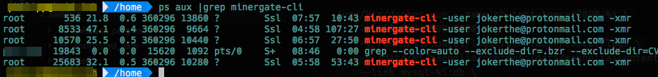
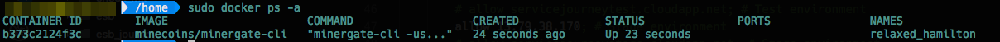

Today was a really strange day, one of my ex colleagues was asking for help in our Google-Hangouts channel. His problem was, that somehow, someone or something installed a crypto currency miner on his Ubuntu virtual server which was heavy on mining [Monero](https://getmonero.org/).

His first words were, "Hi guys, i think I've got something bad ..." with this photo as evidence.


We heavily tried to figure out what's going on here, a virus, a malware on a linux system in the wild? I expected that this is not so easy.

After searching system wide with no result, we suspected his Mac book. The idea is not so far away, because Mac uses as default ssh-agent for ssh connections. So our idea was simple, if something bad on his Mac is running with his user privileges, it is easy that this bad thing can use his ssh key to spread crypto miner to all machines he has access too.

Unfortunately, it was not such easy. The Mac was clean. What now, back to the server we checked some more details and found this damn running docker container.


Well, just for completeness, `minecoins/minergate-cli` is an [official](https://github.com/minecoins/docker-minergate-cli) docker image provided by the [MinerGate](https://minergate.com/) mining pool. Someone with the pseudonym `jokerthe@protonmail.com` is abusing their application and we really hate it.

Our next steps were simple. We stopped and removed the container and also the minergate-cli image. Cool, all seems to be good, no more problems, but how the hell did that happen?

We had not enougth time to think about this, because the image was just now reinstalled and the container were started again. This was magic, but the challange was ours!

What's next, killing and removing image and container again and observing `/var/log/auth.log` and `/var/log/syslog`. And waiting, and waiting and... Damn what? What the hell? The syslog showed this:
```
Dec 26 15:57:24 ****** kernel: device veth975a229 entered promiscuous mode
Dec 26 15:57:24 ****** systemd-udevd[23908]: Could not generate persistent MAC address for veth975a229: No such file or directory
Dec 26 15:57:24 ****** kernel: IPv6: ADDRCONF(NETDEV_UP): veth975a229: link is not ready
Dec 26 15:57:24 ****** systemd-udevd[23901]: Could not generate persistent MAC address for veth1729b5a: No such file or directory
Dec 26 15:57:24 ****** kernel: IPVS: Creating netns size=2096 id=26
Dec 26 15:57:24 ****** kernel: IPVS: ftp: loaded support on port[0] = 21
Dec 26 15:57:25 ****** kernel: eth0: renamed from veth1729b5a
Dec 26 15:57:25 ****** kernel: IPv6: ADDRCONF(NETDEV_CHANGE): veth975a229: link becomes ready
Dec 27 15:57:25 ****** kernel: docker0: port 6(veth975a229) entered forwarding state
Dec 26 15:57:25 ****** kernel: docker0: port 6(veth975a229) entered forwarding state
Dec 26 15:57:40 ****** kernel: docker0: port 6(veth975a229) entered forwarding state
```

Nothing else happened. This was a really strange behaviour and I was really worried. It seems that docker has its own will.

Finally, I checked the docker setup and found this file `/etc/docker/daemon.json`. By default, this file is not created. So let's have a look into it.

```
{
	"hosts": [ "fd://", "unix:///var/run/docker.sock", "tcp://0.0.0.0:2376" ]
}
```

Damn man, we got it, `tcp://0.0.0.0:2376` is our selfmade (or maybe not) backdoor here. After proving the public server IP and this port with curl from my local machine, I finally had the proof. This misconfiguration could be used to control without any security the docker daemon on the server from anywhere.

We changed this configuration and since this, nothing more happened until now. But we still can not answer the question, who did placed this config there.