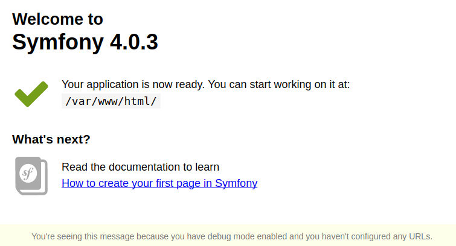

[Docker](https://www.docker.com/) is one of my favorite tools out there and as a software engineer, I use it every day for my web based projects. The big benefit is, that you can encapsulate all libraries, tools and what ever your application needs in one single container. Big player like Amazon and Microsoft also relies on the power of docker.

What I want to show here is my default setup skeleton of the most of my projects. You can use this setup also for production environments, but I will only concentrate here on local development environment which ensures that every dev in your team can use the same environment. Forget old slow stuff like [Vagrant](https://www.vagrantup.com/), the virtualization overhead is too much. With docker and especially [docker-compose](https://docs.docker.com/compose/) as management tool, you can simply setup a whole network infrastructure for you application. In my opinion, microsoervices are the future of web based software and with approaches like docker, this is an ease.

The next important thinking related to your application, should be **API first**. Wherever I can, I strictly implement my software as first as an [API](https://en.wikipedia.org/wiki/Application_programming_interface), the [GUI](https://en.wikipedia.org/wiki/Graphical_user_interface) and any other kind of interface are playing the second role.

This writing is separated in multiple steps for an easier following and checking.

## 1. Filesystem structure
Let's make the hands dirty and create an empty folder for our dummy project. My one is under `~/blog/skeleton`. Under that folder, we create another empty one, which we name `app`. This is the place where later the sources of our application is located. For now it's just an empty folder.

The first file we should create is a `README.md` file. Our content here is for now: `Hello skeleton project`.

### 1.1. MySQL files
If we use [Symfony](https://symfony.com/), it is typical that we also use [Doctrine](http://www.doctrine-project.org/) in combination with [MySQL](https://www.mysql.com). For this we prepare a folder for MySQL related log files. A simple `mkdir -p logs/mysql` is all what we need at first step. The second one is `echo '*' > logs/mysql/.gitignore`, because we don't want our log files versioned by [Git](https://git-scm.com/). MySQL should also store it's data on your host machine, not inside the container. So your data is not removed if you later rebuild container or doing some other things. For that, our last MySQL related folder is simply named `db`, let's create it with `mkdir db`. All inside this folder should also be ignored by git. So we need also here a `echo '*' > db/.gitignore`.

The next file we place under `~/blog/skeleton` is `database.env.dist`. This is includes an example configuration which can be adjusted by any other developer by copying the file to `database.env` and make changes to this new file. This is a typical distribution setup. We configure git later to ignore all `*.env` files, because no private configuration which could have sensitive data inside, should be versioned by git. The content of our `env.dist` file is this:
```
MYSQL_DATABASE=change_db_name
MYSQL_ROOT_HOST=%
MYSQL_ROOT_PASSWORD=changeme123
```

### 1.2. Application files
We need a second `env.dist` file for our application, so we create the `app.env.dist` file with this content:
```
XDEBUG_CONFIG=remote_host=172.17.0.1 idekey=skeleton-app remote_enable=1 auto_trace=0 profiler_enable=1 profiler_output_dir=/var/www/html/var/logs/xdebug profiler_enable_trigger=1 max_nesting_level=1000
PHP_IDE_CONFIG=serverName=app_host
```

As you see, with this configuration we control our [Xdebug](https://xdebug.org/) settings we later use with [PhpStorm](https://www.jetbrains.com/phpstorm/), in my eyes one of the most powerful PHP IDE's out there, the money it costs is worth it. Of course, you are free to use any other IDE of your choice.

### 1.3. Open git files
The only git file we are still missing, is the `.gitignore` in the root folder. Create this file with this content:
```
*.env
.idea
```

`.idea` contains the PhpStorm related project meta data and we don't wanna have this versioned by git.

### 1.4. Docker files

#### 1.4.1. App image
We use three own docker images in our project. The first one is a our application container which runs PHP. For this we run `mkdir -p docker/app` and we are placing under this folder a `Dockerfile` with this content:
```
FROM php:7.1-fpm
MAINTAINER Romano Kleinwaechter

RUN apt-get update && \
  apt-get install \
    git \
    zip \
    unzip \
    zlib1g-dev \
  -y

RUN docker-php-ext-install zip pdo_mysql

RUN pecl install \
  xdebug \

  && \

  docker-php-ext-enable \
    xdebug

# Upload sizes
RUN \
  echo ''                                              >> /usr/local/etc/php-fpm.d/www.conf && \
  echo ''                                              >> /usr/local/etc/php-fpm.d/docker.conf && \
  echo 'php_admin_value[post_max_size] = 10M'          >> /usr/local/etc/php-fpm.d/www.conf && \
  echo 'php_admin_value[post_max_size] = 10M'          >> /usr/local/etc/php-fpm.d/docker.conf && \
  echo 'php_admin_value[upload_max_filesize] = 10M'    >> /usr/local/etc/php-fpm.d/www.conf && \
  echo 'php_admin_value[upload_max_filesize] = 10M'    >> /usr/local/etc/php-fpm.d/docker.conf

# install composer
RUN cd /tmp \
  && php -r "copy('https://getcomposer.org/installer', 'composer-setup.php');" \
  && php composer-setup.php --filename=composer --install-dir=/usr/local/bin \
  && unlink composer-setup.php

# install symfony 3 tool
RUN php -r "readfile('https://symfony.com/installer');" > /usr/local/bin/symfony && \
  chmod +x /usr/local/bin/symfony

# disbale xdebug for composer
RUN mkdir /usr/local/etc/php/conf.d.noxdebug \
  && ln -s /usr/local/etc/php/conf.d/* /usr/local/etc/php/conf.d.noxdebug/ \
  && unlink /usr/local/etc/php/conf.d.noxdebug/docker-php-ext-xdebug.ini \
  && echo "alias composer='PHP_INI_SCAN_DIR=/etc/php.d.noxdebug/ /usr/local/bin/composer'" >> /etc/bashrc

# change php-fpm port
RUN find /usr/local/etc/php-fpm.d/ -type f -exec sed -i 's/9000/9999/g' "{}" \;

# cleanup
RUN apt-get autoremove -y && apt-get autoclean

```

#### 1.4.2. MySQL image
Our second image is for MySQL. Let's run `mkdir docker/db` and place there this `Dockerfile`:
```
FROM mysql:5.7
MAINTAINER Romano Kleinwaechter

# enable query log
RUN \
	echo 'general_log_file = /var/log/mysql/mysql.log'    >> /etc/mysql/mysql.conf.d/mysqld.cnf && \
	echo 'general_log = 1'                                >> /etc/mysql/mysql.conf.d/mysqld.cnf && \
	echo 'long_query_time = 2'                            >> /etc/mysql/mysql.conf.d/mysqld.cnf

RUN apt-get autoremove -y && apt-get autoclean

```

#### 1.4.3. PHP-FPM proxy image
The last own image is based on the official docker nginx image with our default proxy configuration. We create `docker/nginx` and this `Dockerfile` under that path:
```
FROM nginx:1.13.1
MAINTAINER Romano Kleinwaechter

# remove original default.conf
RUN unlink /etc/nginx/conf.d/default.conf

```

The last file for that image is `docker/nginx/proxy.conf`, which contains the nginx default setup for symfony based php fpm projects and some customs adjustments:
```
server {
        listen 80;
        listen [::]:80;
        server_name app.local;

        access_log /dev/stdout;
        error_log /dev/stderr;

        root /var/www/html/public;

        index index.php index.html;

        client_max_body_size 10M;

        location / {
                try_files $uri /index.php$is_args$args;
        }

        location ~ ^/index\.php(/|$) {
                fastcgi_pass app:9999;
                fastcgi_split_path_info ^(.+\.php)(/.*)$;
                include fastcgi_params;
                
                # When you are using symlinks to link the document root to the
                # current version of your application, you should pass the real
                # application path instead of the path to the symlink to PHP
                # FPM.
                # Otherwise, PHP's OPcache may not properly detect changes to
                # your PHP files (see https://github.com/zendtech/ZendOptimizerPlus/issues/126
                # for more information).
                fastcgi_param SCRIPT_FILENAME $realpath_root$fastcgi_script_name;
                fastcgi_param DOCUMENT_ROOT $realpath_root;
                
                # Prevents URIs that include the front controller. This will 404:
                # http://domain.tld/index.php/some-path
                # Remove the internal directive to allow URIs like this
                internal;
        }

        # return 404 for all other php files not matching the front controller
        # this prevents access to other php files you don't want to be accessible.
        location ~ \.php$ {
                return 404;
        }
}

```

Of course, we are using some more containers, not just this three, but for now we only need this three custom images for our three base containers.

### 1.5. Docker compose files
Because we use a multi container setup, we use docker-compose for a much easier handling. For this we create a `docker-compose.yml` file.

#### 1.5.1. Version
The first thing we do here is to version our file, at this at first line:
```
version: '2'
```

#### 1.5.2. Network
We setup our own tier for our network by adding this configuration at the third line (the second is blank):
```
networks:
  app_tier:
    driver: bridge
    ipam:
     config:
       - subnet: 172.11.1.0/16
         gateway: 172.11.5.254
```

#### 1.5.3. Services
Now we describe the setup of our application containers. Each container has it's own block under services. We start with the app container configuration.

**App container**
```
  app:
    build: docker/app
    image: sekelton/app
    env_file:
      - ./app.env
    networks:
      app_tier:
        ipv4_address: 172.11.1.2
    volumes:
      - ./app:/var/www/html
```

**Database container**
```
  db:
    build: docker/db
    image: skeleton/db
    networks:
      app_tier:
        ipv4_address: 172.11.1.1
    ports:
      - "3306:3306"
    env_file:
      - ./database.env
    volumes:
      - ./logs/mysql:/var/log/mysql
      - ./db:/var/lib/mysql
```

**Nginx container**
```
  nginx:
    build: docker/nginx
    image: skeleton/nginx
    networks:
      app_tier:
        ipv4_address: 172.11.1.3
    ports:
      - "80:80"
    volumes_from:
      - app:ro
    volumes:
      - ./docker/nginx/proxy.conf:/etc/nginx/conf.d/default.conf
```

We use a fourth container here which we don't have defined an image for. This is not necessary because this is our [Selenium](http://www.seleniumhq.org/) and a ready to use image for this already exists.
However, we need to configure it.

**Selenium container**
```
  selenium:
    image: selenium/standalone-chrome:latest
    networks:
      app_tier:
        ipv4_address: 172.11.1.4
```

Our full and ready to use `docker-compose.yml` file looks as follows:
```
version: '2'

networks:
  app_tier:
    driver: bridge
    ipam:
     config:
       - subnet: 172.11.1.0/16
         gateway: 172.11.5.254

services:

  db:
    build: docker/db
    image: skeleton/db
    networks:
      app_tier:
        ipv4_address: 172.11.1.1
    ports:
      - "3306:3306"
    env_file:
      - ./database.env
    volumes:
      - ./logs/mysql:/var/log/mysql
      - ./db:/var/lib/mysql

  app:
    build: docker/app
    image: skeleton/app
    env_file:
      - ./app.env
    networks:
      app_tier:
        ipv4_address: 172.11.1.2
    volumes:
      - ./app:/var/www/html

  nginx:
    build: docker/nginx
    image: skeleton/nginx
    networks:
      app_tier:
        ipv4_address: 172.11.1.3
    ports:
      - "80:80"
    volumes_from:
      - app:ro
    volumes:
      - ./docker/nginx/proxy.conf:/etc/nginx/conf.d/default.conf

  selenium:
    image: selenium/standalone-chrome:latest
    networks:
      app_tier:
        ipv4_address: 172.11.1.4
```

## 2. Building the project
To build our images and container we need at first to copy the files `app.env.dist` and `database.env.dist` to a non `.dist` version and configure them. For this demo we don't tuch the original content. If it's not already done, we should init git now with `git init`, `git add .` and `find ./ -type f -name '.gitignore' -print0 |xargs -0 git add -f`. The last command forces the adding of our `.gitignore` files which are placed under an ignored path.

Our current project file structure is this:
```
➜  skeleton git:(master) ✗ tree -a
.
├── app
├── app.env
├── app.env.dist
├── database.env
├── database.env.dist
├── db
│   └── .gitignore
├── docker
│   ├── app
│   │   └── Dockerfile
│   ├── db
│   │   └── Dockerfile
│   └── nginx
│       ├── Dockerfile
│       └── proxy.conf
├── docker-compose.yml
├── .git
│   └── <not shown>
├── .gitignore
├── logs
│   └── mysql
│       └── .gitignore
└── README.md

27 directories, 35 files
```

### 2.1. Build images
We can build and pull our images now with this command `sudo docker-compose build`. Please note that all commands related to docker are only available as admin user. The reason why I do it this way is too much for this article, however you should know that every user who can run docker, has indirectly the permission to access your physical host with root privileges. This is a well meant security hint, you find more about this in the official docker documentation.

After a while we can see our fresh build images:
```
➜  skeleton git:(master) ✗ sudo docker images
REPOSITORY                        TAG                 IMAGE ID            CREATED             SIZE
skeleton/db                       latest              96c3f2affd01        33 seconds ago      407MB
skeleton/nginx                    latest              906e6f081d63        37 seconds ago      107MB
skeleton/app                      latest              fd889baf9b12        38 seconds ago      430MB
selenium/standalone-chrome        latest              11258d1f9aba        3 weeks ago         826MB
```

### 2.2. Initial container start
Our images are ready for use, we can now start our container network with `sudo docker-compose up -d`. `-d` signals `docker-compose` to run in the background. If all is fine we should see this output:
```
➜  skeleton git:(master) ✗ sudo docker-compose up -d
Creating network "skeleton_app_tier" with driver "bridge"
Creating skeleton_app_1
Creating skeleton_db_1
Creating skeleton_selenium_1
Creating skeleton_nginx_1
```

We can also verify that all containers are running well:
```
➜  skeleton git:(master) ✗ sudo docker ps
CONTAINER ID        IMAGE                               COMMAND                  CREATED             STATUS              PORTS                    NAMES
8b43146d4a0c        skeleton/nginx                      "nginx -g 'daemon ..."   29 seconds ago      Up 27 seconds       0.0.0.0:80->80/tcp       skeleton_nginx_1
342b66dad266        selenium/standalone-chrome:latest   "/opt/bin/entry_po..."   30 seconds ago      Up 28 seconds       4444/tcp                 skeleton_selenium_1
8ac9d88d94f8        skeleton/app                        "docker-php-entryp..."   30 seconds ago      Up 29 seconds       9000/tcp                 skeleton_app_1
2782ed8e5bf5        skeleton/db                         "docker-entrypoint..."   30 seconds ago      Up 29 seconds       0.0.0.0:3306->3306/tcp   skeleton_db_1
```

**Attention:** You should note here, that this docker setup is not designed for production environments at this point. It's because, this is our development environment and our MySQL database port is bind to `0.0.0.0:3306`. It is public accessible on your host and therefore also on any server where you run this setup!

### 2.3. Initial symfony setup
We should now populate our application with a default symfony setup. Let's do this. At first we enter our `app container` in this way:
```
➜  skeleton git:(master) ✗ sudo docker-compose exec app bash
root@8ac9d88d94f8:/var/www/html#
```

We are now on the root shell of the `app container`. Because of the pre-installed symfony tool is not symfony version 4 compatible, we use `composer` to build a new skeleton symfony app:
```
root@8ac9d88d94f8:/var/www/html# composer create-project symfony/skeleton .
Do not run Composer as root/super user! See https://getcomposer.org/root for details
Installing symfony/skeleton (v4.0.5)
  - Installing symfony/skeleton (v4.0.5): Downloading (100%)         
Created project in .
Loading composer repositories with package information
Updating dependencies (including require-dev)
Package operations: 21 installs, 0 updates, 0 removals
  - Installing symfony/flex (v1.0.57): Downloading (100%)         

Prefetching 20 packages 🎶
  ...
Writing lock file
Generating autoload files
Symfony operations: 4 recipes (2cfa09e6db8aaed855ed992b37044908)
  - Configuring symfony/flex (>=1.0): From github.com/symfony/recipes:master
  - Configuring symfony/framework-bundle (>=3.3): From github.com/symfony/recipes:master
  - Configuring symfony/console (>=3.3): From github.com/symfony/recipes:master
  - Configuring symfony/routing (>=4.0): From github.com/symfony/recipes:master
Executing script cache:clear [OK]
Executing script assets:install --symlink --relative public [OK]

Some files may have been created or updated to configure your new packages.
Don't hesitate to review, edit and commit them: these files are yours.

              
 What's next? 
              

  * Run your application:
    1. Change to the project directory
    2. Execute the php -S 127.0.0.1:8000 -t public command;
    3. Browse to the http://localhost:8000/ URL.

       Quit the server with CTRL-C.
       Run composer require server for a better web server.

  * Read the documentation at https://symfony.com/doc

root@8ac9d88d94f8:/var/www/html#
```

For our development environment we can ignore the hint *"Do not run Composer as root/super user! See [https://getcomposer.org/root](https://getcomposer.org/root) for details"*. This is not recommended for production environments.

For this setup we also need to run `root@8ac9d88d94f8:/var/www/html# chown -R www-data:www-data var/`. Of course, we can handle this with other ways, but for now we do it this way.

### 2.4. Testing setup
It's time to browse [http://localhost/](http://localhost/). If all is fine, you should see an output like this:



### 2.5. Shut down
To shut down your development environment, run this: `sudo docker-compose down`.

### 3. Last words
This all is a real rudimentary setup for a multi container development environment. I'm sure there are some parts to optimize, but this is the basic setup I use daily for my customer projects. My colleague Stephan Altmann is using a similar setup for his [Shopware](https://en.shopware.com/) development which you can find [here](https://salty.rocks/en/blog/docker-container-shopware-development).

You can find the full setup on [Github](https://github.com/rkl-/docker-skeleton-dev-environment).

For any hints, questions and or problems, don't hesitate to contact me.

Future articles will describe other topics like debugging with PhpStorm and using selenium based on this setup.